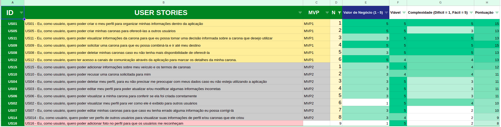
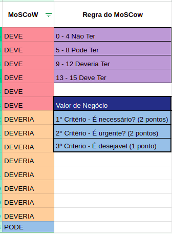

# Apresentação do Backlog (MVP1 e MVP2) 

## Fases de Engenharia de Requisitos 

### 1. Elicitação e Descoberta 

Durante a fase de elicitação e descoberta nós conversamos com o nosso cliente e o ChatGPT para podermos entender quais funcionalidades o site deve ter, assim pudemos identificar os requisitos funcionais e não funcionais do projeto. 

### 2. Análise e Consenso 

Durante a essa fase a equipe realizou uma análise para selecionar quais requisitos funcionais e não funcionais faziam sentido levando em consideração qual problema do cliente queremos resolver e sua viabilidade de implementação. Também procuramos registrar requisitos que antes não foram identificados. Posteriormente foi feita um consenso com o cliente através de conversas para definir se os requisitos identificados são os desejados. 

### 3. Declaração 

Durante a fase de declaração nos reorganizamos os requisitos nos formatos Temas, Épicos e User Stories para ter uma melhor visualização facilitando a leitura e para ter uma visão melhor a respeito das funcionalidades do site. 

### 4. Verificação e Validação

Durante essa fase nos verificamos se os requisitos estão corretamente descritos, são compreensíveis e estão consistentes entre si. Também procuramos corrigir possíveis lacunas, ambiguidades ou contradições. Para isso utilizamos técnicas como revisão em pares e INVEST.

### 5. Organização e Atualização

Na fase de Organização e Atualização através da técnica MoSCoW, onde avaliamos os critérios da técnica entre o time por meio de votação, onde tínhamos 5 pontos para valor de negócio, viabilidade e complexidade, assim conseguimos de uma maneira menos subjetiva (e mais objetiva), definir nossos MVP1 e MVP2.

Durante a unidade 4, foi reavaliado o escopo do MVP2 considerando o entendimento da equipe sobre o produto e suas tecnologia, principalmente, a complexidade técnica das _User Stories_, assim percebemos que a *_US16 - Eu, como usuário, quero poder adicionar foto no perfil para que os usuários me reconheçam_* possuía uma complexidade acima do estabelecido. Ao reajustar o seu valor, consequentemente a matriz MoSCoW programada desceu a prioridade, visto sua pontuação total de 8 de 15, classificado como poderia, e a retirou do MVP2. Validamos com o cliente e o mesmo já havia avaliado anteriormete como baixo valor de negócio, assim retiramos definitivamente do escopo. A seguir nas figuras 1 e 2 pode ser visualizado o backlog dos MVPs.

Figura 1:  Backlog (Fonte: Autor, 2023).

Figura 2:  MoSCoW utilizado (Fonte: Autor, 2023).

### Material

<iframe src='https://app.mural.co/embed/1b1a8780-fe0a-47ed-914b-eb237d9edb1a' width='100%' height='480px' style='min-width: 640px; min-height: 480px; background-color: #f4f4f4; border: 1px solid #efefef' sandbox='allow-same-origin allow-scripts allow-modals allow-popups allow-popups-to-escape-sandbox'></iframe>

<iframe src="https://docs.google.com/spreadsheets/d/e/2PACX-1vQ3Kg5oBr4ZkIB7GxD0izNAElQgeqLWId0RLN7eslGaxbKZM5gWl3cptkTXYDAtR_C2VfP-_50NN6SJ/pubhtml?gid=0&amp;single=true&amp;widget=true&amp;headers=false" width='100%' height='480px' style='min-width: 640px; min-height: 480px; background-color: #f4f4f4; border: 1px solid #efefef' sandbox='allow-same-origin allow-scripts allow-modals allow-popups allow-popups-to-escape-sandbox'></iframe>

<!--  -->

## Histórico de Versão
Data | Versão | Descrição | Autor(es) | Revisor(es)
---- | ------ | --------- | ----- | ---------
11/07/23 | `0.1` | Criação da página | Juan Mangueira | Pedro Henrique
11/07/23 | `0.2` | Atualização da página | Juan Mangueira | Pedro Henrique