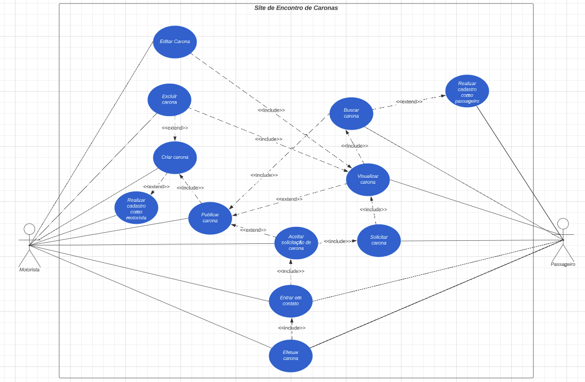

# Diagrama de Casos de Uso

O Diagrama de Casos de Uso foi criado a partir do escopo do problema que o grupo identificou a respeito das caronas solidárias e com isso ele foi estruturado pensando em 2 atores, o motorista e o passageiro. A seguir está representado o Diagrama de Caso de Uso que nosso grupo construiu, presente na figura 1:

Figura 1:  Diagrama de Caso de Uso (Fonte: Autor, 2023).

O arquivo do Diagrama de Caso de Uso pode ser visualizado a seguir:

<iframe allowfullscreen frameborder="0" style="width:640px; height:480px" src="https://lucid.app/documents/embedded/d041ad21-ead7-45df-be9d-ace5dde7b9f7" id="j~EczmlghFjv"></iframe>

## Especificações de Casos de Uso
Em relação às especificações, foram elencadas 5 para serem realizadas, nas quais cada integrante do grupo ficou responsável de desenvolver 1 especificação cada para totalizar 5 especificações de casos de uso. Os casos de uso escolhidos foram:

- Realizar cadastro como passageiro
- Realizar cadastro como motorista
- Criar carona
- Editar carona
- Excluir carona

## Histórico de Versão
Data | Versão | Descrição | Autor(es) | Revisor(es)
---- | ------ | --------- | ----- | ---------
15/07/23 | `1.0` | Criação da página | Pedro Henrique | Juan Mangueira