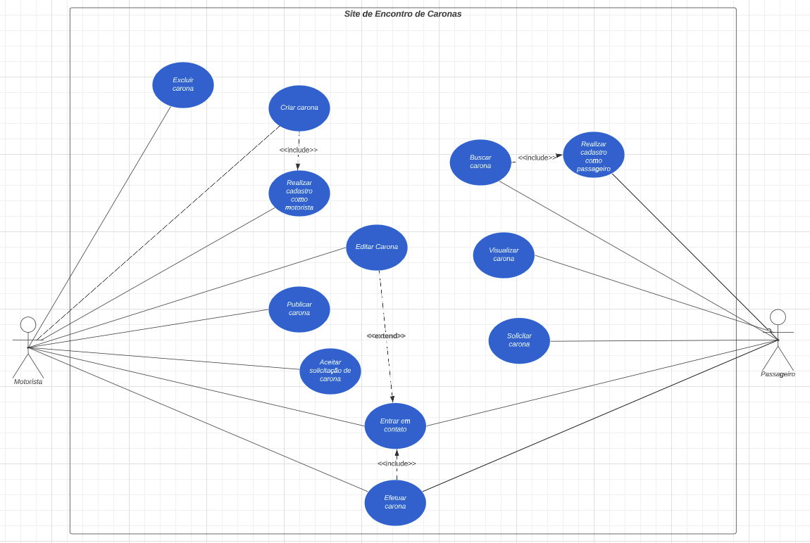

# Especificações de Casos de Uso - Excluir Carona
Baseado no Diagrama de Casos de Uso, foram criados 5 especificações de casos de usos presente no diagrama de acordo com o número de integrantes da equipe. As 5 especificações em questão são:

- [Realizar cadastro como passageiro](../unidade_4/esp_cadastro_pass.md)
- [Realizar cadastro como motorista](../unidade_4/esp_cadastro_mot.md)
- [Criar carona](../unidade_4/esp_criar_carona.md)
- [Editar carona](../unidade_4/esp_editar_carona.md)
- [Excluir carona](../unidade_4/esp_excluir_carona.md)

