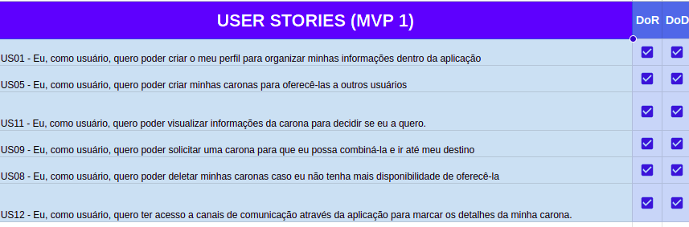
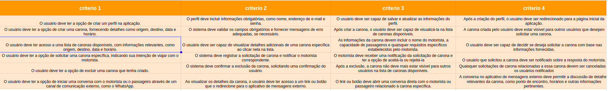

# Apresentação MVP1

## Site
Site: <https://unibuddyunb.netlify.app/>

<iframe width="950" height="600" src="https://unibuddyunb.netlify.app/"></iframe>

## Critérios de Aceitação
<iframe src="https://docs.google.com/spreadsheets/d/e/2PACX-1vQ3Kg5oBr4ZkIB7GxD0izNAElQgeqLWId0RLN7eslGaxbKZM5gWl3cptkTXYDAtR_C2VfP-_50NN6SJ/pubhtml?gid=1768484062&amp;single=true&amp;widget=true&amp;headers=false" width='100%' height='480px' style='min-width: 640px; min-height: 480px; background-color: #f4f4f4; border: 1px solid #efefef' sandbox='allow-same-origin allow-scripts allow-modals allow-popups allow-popups-to-escape-sandbox'></iframe>

## MVP1

Figura 1:  MVP1 (Fonte: Autor, 2023).

Figura 2:  MVP1 (Fonte: Autor, 2023).

## Histórico de Versão

Data | Versão | Descrição | Autor(es) | Revisor(es)
---- | ------ | --------- | ----- | ---------
11/07/23 | `0.1` | Criação da página | Juan Mangueira | Pedro Henrique
