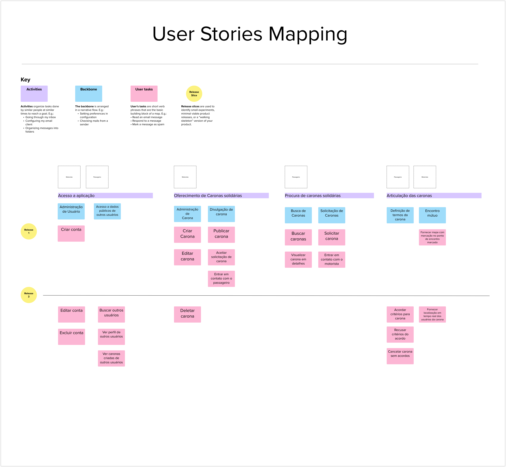

# Apresentação do User Story Mapping

O User Story Mapping (USM) passa pelo conjunto de atividades de ER durante o seu processo de construção e manutenção ao longo do ciclo de vida de desenvolvimento de um produto de software. Com isso, ele busca mapear o conjunto de histórias de usuário que se referem a itens do *Product Backlog* para serem desenvolvidos. Em geral, as histórias são maepadas de acordo com os usuários das histórias, o *Backbone*, tarefas do usuário, atividades, fluxo da narrativa e com *Releases* fatiadas. A seguir na figura 1 está disponibilizado o USM que o grupo criou:

## User Story Mapping (USM)

Figura 1: User Story Mapping (Fonte: equipe Caronetos, 2023)

## Material
Para uma visualização mais detalhada dos artefatos, a seguir está disponível o material que foi produzido:

<iframe src='https://app.mural.co/embed/1b1a8780-fe0a-47ed-914b-eb237d9edb1a' width='100%' height='480px' style='min-width: 640px; min-height: 480px; background-color: #f4f4f4; border: 1px solid #efefef' sandbox='allow-same-origin allow-scripts allow-modals allow-popups allow-popups-to-escape-sandbox'></iframe>

## Apresentação

<iframe width="560" height="315" src="https://www.youtube.com/embed/" title="YouTube video player" frameborder="0" allow="accelerometer; autoplay; clipboard-write; encrypted-media; gyroscope; picture-in-picture; web-share" allowfullscreen></iframe>

## Referência Bibliográficas
> 1. MARSICANO, George. Slides: Unidade 4 - Aula - USM 2023. Disponível em: <https://aprender3.unb.br/pluginfile.php/2518546/mod_folder/content/0/Unidade%204%20-%20Aula%20-%20USM.pdf>

## Histórico de Versão

Data | Versão | Descrição | Autor(es) | Revisor(es)
---- | ------ | --------- | ----- | ---------
11/07/23 | `0.1` | Criação da página | Juan Mangueira | Pedro Henrique
17/07/23 | `1.0` | Adição de conteúdo | Pedro Henrique | Juan Mangueira
