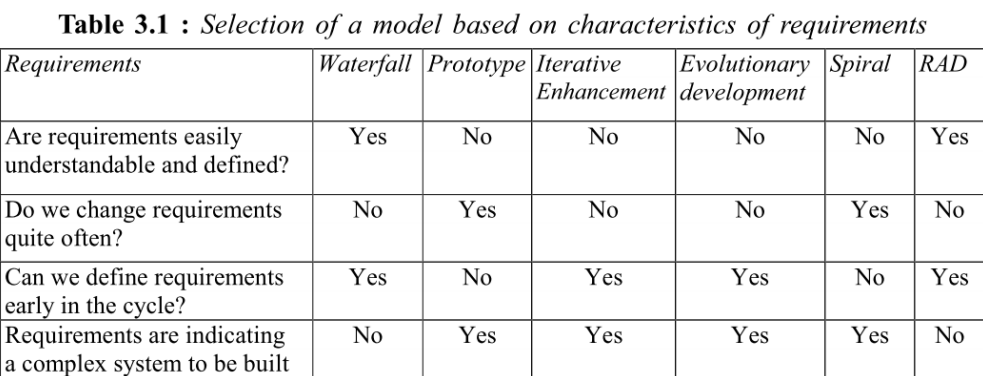
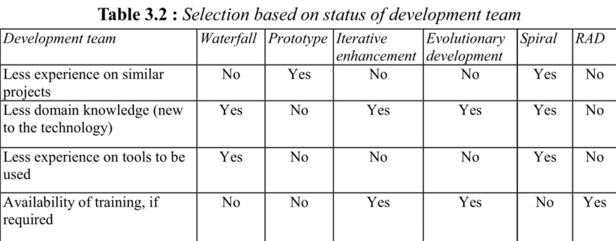
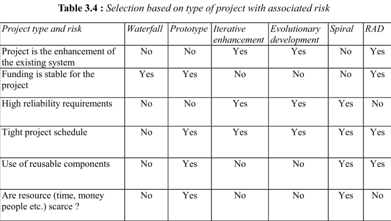
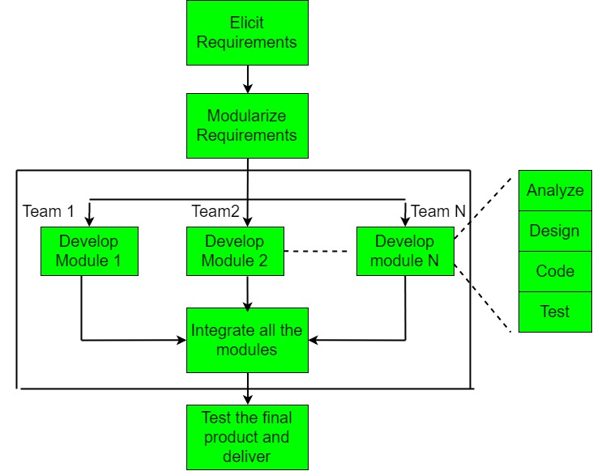

# VISÃO DO PRODUTO E PROJETO

## Historico de revisão

Data | Versão | Descrição | Autor | Revisores
---- | ------ | --------- | ----- | ---------
24/04/23 | 0.1 | Criação do documento | Juan | Pedro Henrique
25/04/23 | 0.2 | Evolução do documento | Juan | Pedro Henrique
26/04/23 | 0.3 | Correções do documento | Juan | Pedro Henrique
26/04/23 | 0.4 | Correções do documento | Juan | João
26/04/23 | 1.0 | Primeira versão de entrega | Juan | João, Juan, Leonardo, Pedro Henrique, Pedro Lucas
27/04/23 | 1.1 | Inclusão lições aprendidas | Juan | Pedro Lucas
19/05/23 | 1.2 | Correção do Planejamento do projeto, das fases e da matriz de comunicação | Juan | João
22/05/23 | 1.3 | Inserção de detalhes na matriz de comunicação, revisão da análise de risco e critérios de replanejamento | Juan | João
24/05/23 | 1.4 | Correção do Planejamento do projeto, da abordagem de desenvolvimneto, das entregas, e da matriz de comunicação, inclusão de item no histórico de replanejamento | Juan | João

## 1.	VISÃO GERAL DO PRODUTO
### 1.1 Problema

O problema se sustenta sobre a falta de meios organizados para realização de caronas solidárias, devido a diversos grupos e situações que podem acontecer quando os usuários (motoristas e passageiros) tentam encontrar caronas solidárias através desses meios. 
Para se entender melhor o problema, foi utilizada a técnica diagrama de ishikawa, também chamado de diagrama da espinha de peixe, com o auxílio da técnica 5 porquês para encontrar as causas raízes e seus principais motivadores. Assim, foram encontradas 4 causas raízes: Tempo do usuário, valor do produto, informação dos usuários e centralização das informações.

Figura 1 - Diagrama de Ishikawa do grupo (fonte: autores, 2023)

### 1.2	Declaração de Posição do Produto

Para | Alunos da FGA 
---- | ---------------------------
Quem | Precisa de carona solidária e não possui meios organizados para encontrá-la ou ofertá-la
O UniBuddy | É um sistema de organização de caronas solidárias
Que |  Auxílio na organização de caronas solidárias, ofertando possibilidade de encontrar pessoas que ofereçam ou precisem receber a carona para determinado local
Ao contrário | Passe-livre, Grupos de carona no WhatsApp, Telegram ou afins
Nosso produto | Ofertará caronas solidárias acessíveis e organizadas

### 1.3	Objetivos do Produto

O objetivo do UniBuddy é auxiliar, de forma organizada e prática, no encontro entre motoristas dispostos a oferecer carona solidária e passageiros que precisam recebê-las. Isso será feito através de uma aplicação que se nutre a partir dos dados dos usuários para disponibilizar informações úteis e organizadas para os interessados, facilitando o encontro de parceiros com o mesmo destino e de confiança. 

### 1.4	Tecnologias a Serem Utilizadas
- Javascript
- HTML
- CSS
- React
- Node.js
- MySQL

## 2.	VISÃO GERAL DO PROJETO
### 2.1	Organização do Projeto
Papel | Atribuições | Responsável | Participantes
----- | ----------- | ----------- | -------------
Pessoa Desenvolvedora | Codificar o produto, realizar refatoração, testar, configurar, versionar, evoluir, integrar, documentar, ata das reuniões, estratégia de código | Leonardo | João, Juan, Pedro Henrique, Pedro Lucas
Líder do Time | Delegar tarefas, duração da iteração, organização das atividades, one-to-one com os membros, estratégia de produto | Juan | Leonardo
Pessoa Engenheira de Requisitos | Descobrir, elicitar, analisar, consensuar, declarar, representar, organizar e atualizar requisitos | Pedro Lucas | João, Leonardo, Pedro Henrique, Juan
Cliente Motorista | Fornecer insumos para requisitos, fornecer feedbacks sobre os produtos, priorizar requisitos | Pedro Henrique | Victor Eduardo Araújo Ribeiro
Cliente Passageiro | Fornecer insumos para requisitos, fornecer feedbacks sobre os produtos, priorizar requisitos | Pedro Henrique | Arthur Mariano de Sousa
Monitor | Verificar requisitos, fornecer feedbacks sobre o processo de ER, auxiliar em dúvidas da equipe acerca da disciplina de requisitos, articular os interesses do professor | Juan | Victor Cabral

### 2.2	Planejamento das Fases do Projeto
Iterações | Produto (Entrega) | Data Início | Data Fim
---- | ----------------- | ----------- | --------
Iteração 1 | Requisitos descobertos, elicitados, analisados e consensuados | 02/05/23 | 08/05/23
Iteração 2 | Requisitos validados, verificados e declarados | 09/05/23 | 15/05/23
Iteração 3 | Requisitos organizados e atualizados, escopo MVP1 e MVP2  | 16/05/23 | 25/05/23
Iteração 4 | Primeira versão MVP1 | 26/05/23 | 05/06/23
Iteração 5 | Versão prévia MVP1 | 06/06/23 | 12/06/23
Iteração 6 | Versão definitiva MVP1 | 13/06/23 | 19/06/23
Iteração 7 | Correções MVP1 | 20/06/23 | 26/06/23
Iteração 8 | Primeira versão MVP2 | 27/06/23 | 03/07/23
Iteração 9 | Versão prévia MVP2 | 04/07/23 | 10/07/23
Iteração 10 | Versão definitiva MVP2 | 11/07/23 | 18/07/23

### 2.3	Matriz de Comunicação
Descrição | Área/Envolvidos | Periodicidade | Produtos Gerados
--------- | ----------------- | ----------- | ----------------
Acompanhamento Diário | Equipe do Projeto | Diário | Relato por parte dos membros da equipe no WhatsApp sobre o andamento individual das partes do projeto
Acompanhamento de Iteração | Equipe do Projeto e Monitor | Semanal | Ata da Reunião, Relação de Feedbacks sobre as entregas do produto
Comunicar a situação do projeto | Equipe do Projeto e Professor | Mensalmente | Artefatos solicitados, Relação de Feedbacks do Professor

### 2.4	Gerenciamento de Riscos
A análise e gerenciamento de riscos referem-se à identificação dos possíveis pontos que podem representar riscos para o projeto. Precisam ser acompanhados, a cada acompanhamento das fases, se referindo assim, ao projeto como um todo e não apenas ao produto.

Segundo Charette, existem três tipos de riscos de Software (PRESSMAN,2006):

1. Riscos de projeto: mostram problemas potenciais de orçamento, cronograma, organizacionais que impactam o projeto;
2. Riscos técnicos: perturbam a qualidade e a entrega do software. Também mostram problemas potenciais de projeto, implementação, interface, verificação e manutenção;
3. Riscos de negócio: ameaçam a viabilidade do software e do produto e apresentam 5 variações:
    1. Risco de Mercado: criar um excelente produto ou sistema que ninguém realmente quer;
    2. Risco Estratégico: criar um produto que não se encaixe mais na estratégia geral de negócios da empresa;
    3. Risco de Vendas: criar um produto que a equipe de vendas não sabe como vender;
    4. Risco Gerencial: perda de suporte da alta gerência devido à mudança no foco ou mudança de profissionais;
    5. Risco de Orçamento: perda do orçamento ou do comprometimento dos profissionais.

Com isso, podemos avaliar o impacto causado pela consequência desse risco, segundo a categoria e os componentes, como vemos na imagem abaixo.

Figura 2 - Avaliação de impacto (fonte: autoures, 2023)

#### 2.4.1 Histórico de Riscos

Iteração | Risco Encontrado | Categoria
------ | ---------------- | -----
Iteração 2 | Risco de Projeto | Crítico 2
Iteração 3 | Risco Técnicos | Crítico 2

### 2.5	Critérios de Replanejamento
Os critérios de replanejamento referem-se à identificação dos pontos que, caso ocorram, causarão um replanejamento do projeto. Precisam ser acompanhados a cada iteração, referindo-se assim, ao projeto como um todo e não apenas ao produto.

- Alteração nos prazos das entregas da Disciplina ou do Cliente
- Alteração das ferramentas do projeto
- Alteração no Processo de Engenharia de Requisito ou Desenvolvimento de Software
- Alteração no Escopo do Projeto, a pedido do professor
- Atrasos de mais de 2 semanas nas entregas
- Barreiras externas para execução do projeto, tais como: aparatos legais, valor financeiro inacessível, capacidade dos hardwares dos desenvolvedores etc
- Saída de algum membro da equipe

Os critérios de replanejamento do projeto devem ser acompanhados e atualizados a cada fase. E, aplicados, conforme necessidade.

#### 2.5.1 Histórico de Replanejamento
Iteração | Problema | Solução Encontrada | Resultado Esperado
------ | -------- |------------------ | ------------------
Interação 3 | Atrasos de mais de 2 semanas  | Alterar cronograma do projeto | Adequação aos prazos solicitados
Interação 3 | Alteração no Processo de Engenharia de Requisito ou Desenvolvimento de Software | Alterar cronograma do projeto e entregas | Adequação aos prazos solicitados

## 3 PROCESSO DE DESENVOLVIMENTO DE SOFTWARE
### 3.1 Metodologia
Baseado na proposta do Gupta (2019), foi respondido um conjunto de questões distintas sobre determinados tópicos para definir a abordagem que melhor se encaixa ao projeto e time. Tópicos norteadores:

1. Requisitos
2. Equipe de Desenvolvimento
3. Usuários
4. Tipo de Projeto e Riscos Associados

#### 3.1.1 Requisitos

Figura 3 - Modelo Gupta para requisitos (fonte: Gupta, 2019)

Pergunta | Nosso contexto
-------- | --------------- 
Os requisitos são fáceis de entender e definir? | Sim.
Nós mudamos os requisitos com bastante frequência? | Não.
Nós podemos definir os requisitos ao início de cada ciclo? | Sim.
Os requisitos estão indicando um sistema complexo para se construir? | Sim.

Conclusão: Em termos de requisitos, temos o indicativo para o RAD e Desenvolvimento Evolutivo.

#### 3.1.2 Equipe de Desenvolvimento

Figura 4 - Modelo Gupta para equipe de desenvolvimento (fonte: Gupta, 2019)

Pergunta | Nosso contexto
-------- | --------------
Pouca experiência em projetos similares? | Sim.
Pouco conhecimento de domínio (novato na tecnologia)? | Não.
Pouca experiência com as ferramentas que serão usadas? | Sim.
Disponibilidade para treinamento, se necessário | Sim. 

Conclusão: Em termos de equipe de desenvolvimento, temos o indicativo para o Spiral e o RAD.

#### 3.1.3 Usuários

Figura 5 - Modelo Gupta para usuários (fonte: Gupta, 2019)

Pergunta | Nosso contexto 
-------- | -------------- 
Usuário está envolvido em todas as fases? | Sim. 
Participação limitada do usuário? | Não.
Usuário não tem experiência anterior em participação em projetos similares? | Não.
Usuário são especialistas no domínio do problema? | Sim.

Conclusão: Em termos de usuário, temos o indicativo para o RAD e Protótipo

#### 3.1.4 Tipo de Projeto e Risco Associado

Figura 6 - Modelo Gupta para tipo de projeto e risco associado (fonte: Gupta, 2019)

Pergunta | Nosso contexto
-------- | --------------
O projeto é melhoria de um sistema existente? | Não.
O financiamento está estável para o projeto? | Sim.
Requisitos de alta confiabilidade? | Não.
Cronograma do projeto é apertado? | Sim.
Uso de componentes reutilizáveis? | Sim.
Os recursos (Tempo, dinheiro, pessoas etc) estão escassos? | Sim.   

Conclusão: Em termos de Tipo de Projeto e Risco Associado, temos o indicativo para o Protótipo e RAD

#### 3.1.5 Escolha do Processo de Desenvolvimento de Software

Figura 7 - Procedimento do RAD (fonte: MARSICANO, 2023)

Considerando o foco principal no nosso usuário, a pouca experiência dos membros da equipe e o risco associado, além do cronograma da disciplina, entendemos que devemos utilizar uma abordagem híbrida, com uma abordagem dirigida a plano, com o método cascata, na fase de requisitos e com as fases seguintes, utilizando o método ágil de desenvolvimento RAD (Rapid Application Development) (SWEBOK, p. 170).

### 3.2 Ferramentas
Para a execução dessa metodologia, escolheu-se as seguintes Ferramentas de organização e controle da equipe:

- Gerenciamento de tarefas: GitHub Projects
- Comunicação: WhatsApp e Teams
- Versionamento: GitHub
- Interface de Desenvolvimento: VSCode

### 3.3 Processos e Procedimentos

#### 3.3.1 Escolhas do Processo de Engenharia de Requisitos

Figura 8 - Faceta da engenharia de requisitos (fonte: MARSICANO, 2023)

Figura 8 - Faceta da engenharia de requisitos (fonte: MARSICANO, 2023)

Com base nas Facetas do Processo de ER (IREB, 2022), foi definido que é processo de ER orientado a produto, visto que: 
1. Alvo é o mercado; 
2. O propósito é exploratório; 
3. Tempo é interativo.

#### 3.3.2 Atividades do Processo de Engenharia de Requisitos

Figura 9 - Atividades da ER (fonte: MARSICANO, 2023)

Assim, incluímos as atividades de ER (MARSICANO, 2023) dentro dos procedimentos do processo de desenvolvimento de software RAD, pontuado no tópico 3.

#### 3.3.3 ATIVIDADES RAD
A metodologia *Rapid Application Development*, também chamado de RAD é um processo incremental na qual desenvolvemos as atividades descritas na figura 10. A metodologia envolve desenvolver módulos que apresentam as fases de análise, design, codificação e testagem. Esses módulos são desenvolvidos por equipes específicas, de forma paralela, e isso é desenvolvido a partir dos requisitos que foram elicitados e modularizados na iteração. Assim, várias técnicas e ferramentas de desenvolvimento são utilizadas para o desenvolvimento desses módulos. A ideia é que ao integrar esses módulos, o produto final é testado e entregado.

Nosso grupo optou por utilizar um método híbrido que envolve o uso de cascata nos requisitos iniciais que elicitamos, enquanto que nas fases posteriores utilizaremos de abordagens ágeis e o processo do RAD como um todo. Com isso, vamos separar nossos 5 membros em dois times que vão estar trabalhando paralelamente em módulos diferentes.

Figura 10 - Modelo de trabalho do RAD (fonte: *Software Engineering | Rapid application development model*, 2023)

##### 3.3.3.1	REQUISITOS E PLANEJAMENTO
###### 3.3.3.1.1 DESCOBERTA E ELICITAÇÃO DE REQUISITOS
Fase focada em encontrar, extrair, obter ou provocar uma resposta, reação, informação dos usuários para construção dos requisitos (MARSICANO, 2023).

Identificador | Atividade | Método | Ferramenta | Entrega
------------- | --------- | ------ | ---------- | -------
ELI-01 | Elicitação e Descoberta | Diagrama de causa e 5 porquês | Mural | Backlog de requisitos não validado

###### 3.3.3.1.2 ANALISE E CONSENSO DE REQUISITOS
Fase focada em analisar os requisitos brutos e conciliar os interesses dos _stakeholders_ (MARSICANO, 2023).

Identificador | Atividade | Método | Ferramenta | Entrega
------------- | --------- | ------ | ---------- | -------
AA-01 | Análise e Consenso | Análise de Viabilidade | Teams | Backlog de requisitos validados

###### 3.3.3.1.3 DECLARAÇÃO DE REQUISITOS
Fase focada em comunicar os requisitos para os interessados em diferentes níveis de glanularidade e dividindo entre funcionais e não funcionais (MARSICANO, 2023)

Identificador | Atividade | Método | Ferramenta | Entrega
------------- | --------- | ------ | ---------- | -------
DEC-01 | Declaração | Temas, Epicos e User Stories | Mural | User Stories representadas

###### 3.3.3.1.4 VERIFICAÇÃO E VALIDAÇÃO DE REQUISITOS
Fase focada em manter os requisitos do produto estruturados, organizados e atualizados (MARSICANO, 2023)

Identificador | Atividade | Método | Ferramenta | Entrega
------------- | --------- | ------ | ---------- | -------
GEREN-01 | Verificação e Validação | Feedback | Reunião | User Stories validadas

###### 3.3.3.1.5 GERENCIAMENTO DE REQUISITOS (ORGANIZAÇÃO E ATUALIZAÇÃO)
Fase focada em manter os requisitos do produto estruturados, organizados e atualizados (MARSICANO, 2023)

Identificador | Atividade | Método | Ferramenta | Entrega
------------- | --------- | ------ | ---------- | -------
GEREN-01 | Organização e Atualização | MoSCoW | Mural e Excel | Definição de prioridades (MVP1 e MVP2)

##### 3.3.3.2 PROTOTIPAÇÃO E FEEDBACK
###### 3.3.3.2.1 REPRESENTAÇÃO DE REQUISITOS (PROTÓTIPO)
Apresentação dos requisitos em modelos e/ou visualizações do produto (MARSICANO, 2023)

Identificador | Atividade | Método | Ferramenta | Entrega
------------- | --------- | ------ | ---------- | -------
PRO-01 | Construção de prototipo de Baixa Fidelidade | Prototipagem | Figma | Prototipo de baixa fidelidade
PRO-02 | Construção de prototipo de Média Fidelidade | Prototipagem | Figma | Prototipo de média fidelidade
PRO-03 | Construção de prototipo de Alta Fidelidade | Prototipagem | Figma | Prototipo de alta fidelidade

###### 3.3.3.2.2    VALIDAÇÃO E VERIFICAÇÃO DE REQUISITOS (PROTÓTIPO)
Validação é confirmar ou não se os requisitos definem a solução correta conforme consensuado entre os _stakeholders_ (MARSICANO, 2023). Enquanto verificação é garantir se os requisitos foram ou não executados na maneira correta (MARSICANO, 2023). Assim como faz parte dessa fase, definir o preparado (DoR) e o pronto (DoD).

Identificador | Atividade | Método | Ferramenta | Entrega
------------- | --------- | ------ | ---------- | -------
VAP-01 | Coleta de Feedbacks sobre os protótipos | Feedback | Teams e Figma | Relação de feedbacks

##### 3.3.3.3 CONSTRUÇÃO
###### 3.3.3.3.1 CONSTRUÇÃO MÓDULOS

Identificador | Atividade | Método | Ferramenta | Entrega
------------- | --------- | ------ | ---------- | -------
CM-01 | Desenvolvimento da Aplicação | PairProgramming | VSCODE, GitHub, Navegador | Módulo Unitário

###### 3.3.3.3.1 VALIDAÇÃO MÓDULOS

Identificador | Atividade | Método | Ferramenta | Entrega
------------- | --------- | ------ | ---------- | -------
VAM-01 | Atividade de Validação dos Módulos | Feedback | Teams e Navegador | Relação de Feedbacks

##### 3.3.3.4 CUTOVER
###### 3.3.3.4.1 INTEGRAÇÃO MÓDULOS

Identificador | Atividade | Método | Ferramenta | Entrega
------------- | --------- | ------ | ---------- | -------
IT-01 | Integração de Módulos | União de Módulos | GitHub, VSCODE e Navegador | Módulo Integrado

###### 3.3.3.4.2 TESTE PRODUTO

Identificador | Atividade | Método | Ferramenta | Entrega
------------- | --------- | ------ | ---------- | -------
TP-01 | Testagem do Produto | Teste Manual, Teste de Módulo, Teste de Integração, Teste de Sistema, Teste de Aceitação | VSCODE, GitHub | Relatório de Testes

### 3.4 Arquitetura do Projeto
?

## 4. LIÇÕES APRENDIDAS
### Unidade 1
Com base nos feedbacks recebidos, podemos extrair algumas lições aprendidas importantes no projeto. Primeiramente, é notável que a interação entre os membros do grupo está positiva e a comunicação está fluindo bem, o que pode ser atribuído ao fato de que o grupo está unido como um time e está passando feedbacks constantes. Além disso, o grupo está sendo proativo nas entregas e as tarefas estão bem divididas, o que demonstra organização e alinhamento, principalmente em momentos de necessidade.

Por outro lado, os feedbacks construtivos indicam que o grupo precisa melhorar em alguns aspectos, como a qualidade das atividades entregues, divisão equilibrada das responsabilidades entre os membros e organização da comunicação. Em relação à qualidade das entregas, o feedback construtivo recebido trás como medida sugestiva uma revisão mais criteriosa antes da entrega. Em seguida, é necessário repensar a forma como as atividades são divididas de modo a permitir que todos os membros do grupo produzam efetivamente. Além disso, a comunicação precisa ser mais organizada para evitar a mistura de informações importantes e irrelevantes simultaneamente.

Por fim, é essencial que todos os membros do grupo estejam acompanhando bem as atividades e assumindo responsabilidades equilibradas, além de cada membro ter um papel claro dentro do grupo e que esteja engajado em acompanhar as atividades propostas, garantindo que não haja atrasos ou sobrecarga de responsabilidades em alguns membros. Como resultado, espera-se que após uma gestão de equipe eficiente e equilibrada, teremos uma maior efetividade do projeto.

## 5. A MELHORAR
### Unidade 1
- Lições Aprendidas
- Planejamento das iterações
- Critérios de riscos
- Critérios de replanejamento
- Processos e atividade de Requisitos

## 6. REFERÊNCIAS BIBLIOGRÁFICAS 

> 1. MARSICANO, George. Slides: Escolhas da Engenharia de Software. 2023. Disponível em: <https://aprender3.unb.br/pluginfile.php/2518488/mod_folder/content/0/Unidade%201%20-%20Aula%20-%20Escolhas%20da%20ESW.pdf>
> 2. Raja Gupta. Fundamentals of Software Engineering. Engineering Handbook. 2019
> 3. IEEE. SWEBOK. Version 3. 2014.
> 4. Handbook IREB CPRE Foundation Level, Version 1.1.0, september 2022.
> 5. MARSICANO, George. Slides: Introdução a Engenharia de Requisitos. 2023. Disponível em: <https://aprender3.unb.br/pluginfile.php/2518489/mod_folder/content/0/Unidade%201%20-%20Aula%20-%20Introducao%20a%20ER.pdf> 
> 6. Software Engineering | Rapid application development model, 2023. Disponível em <https://www.geeksforgeeks.org/software-engineering-rapid-application-development-model-rad/> Acesso em 24 de maio de 2023.